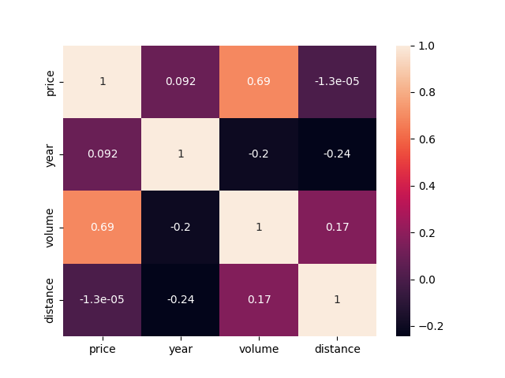
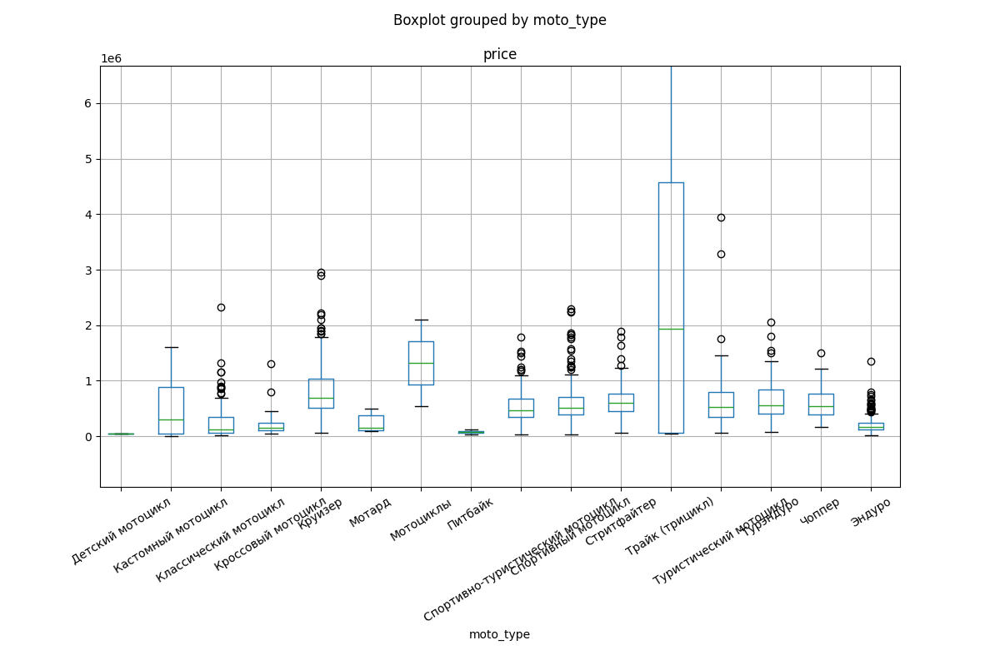
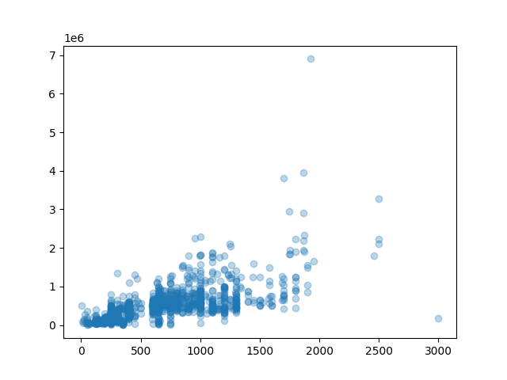

Для README нужно знать чуть больше про проект. Но вот шаблон который ты заполнишь:

# 🏍️ Moto Price Analyzer

Парсер мотоциклов с Drom.ru + модель предсказания рыночной цены на основе CatBoost.

## 📌 Описание

Проект собирает объявления о продаже мотоциклов, сохраняет их в PostgreSQL и обучает модель которая предсказывает справедливую рыночную цену по характеристикам мотоцикла. Помогает находить выгодные объявления где цена ниже рыночной.

## 🛠️ Стек

- **Парсинг:** Python, BeautifulSoup4, Requests
- **Данные:** PostgreSQL, SQLAlchemy, Pandas
- **Модель:** CatBoost, Scikit-learn
- **Визуализация:** Matplotlib, Seaborn

## 📁 Структура проектаmoto_project/
├── parser/
│   └── drom.py          # Парсер Drom.ru
├── data/
│   ├── database.py      # Работа с PostgreSQL
│   └── motos_drom.csv   # Сырые данные
├── model/
│   └── train.py         # Обучение модели
└── README.md
## 📊 Результаты модели

| Метрика | Значение |
|---|---|
| MAE | 120,123 ₽ |
| R² | 0.852 |

Модель объясняет **85.2%** вариации цен. Средняя ошибка предсказания — **120,000 ₽**.

## 🔍 Ключевые выводы

- Объём двигателя — главный фактор цены (41.5% важности)
- Год выпуска на втором месте (30.1%)
- Эндуро и питбайки значительно дешевле стритфайтеров и круизеров

## 🚀 Запускbash
# Установка зависимостей
pip install -r requirements.txt

# Парсинг данных
python parser/drom.py

# Обучение модели
python model/train.py
## 📦 Зависимостиrequests
beautifulsoup4
lxml
pandas
sqlalchemy
psycopg2-binary
catboost
scikit-learn
matplotlib
seaborn
```
```

MSE я не включил — это не самая информативная метрика для человека читающего README, MAE и R² достаточно и они понятнее.

Скриншоты графиков тоже добавь — heatmap и boxplot по типам выглядят хорошо. В README добавляется так:



